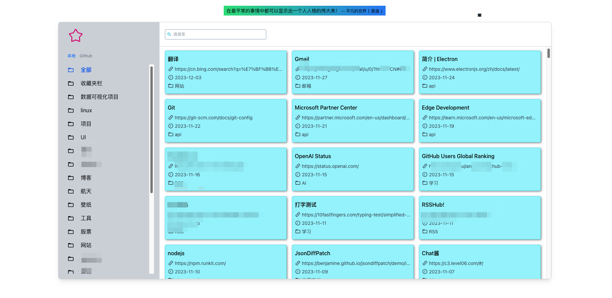

[中文文档](./README_zh.md)

<div align="center">

<h1> A better browser extension bookmarking tool </h1>


</div>

## Rendered Images

<div align="center">

</div>

## Configuration Options

<div align="center">

</div>

## Explanation

### Description of Settings

- Remember Selected Category: When you choose `Local` or `Github`, the selected category will be remembered when opening or refreshing the tab.
- Remember Selected Folder: When you select a folder, the selected folder will be remembered when opening or refreshing the tab.
- Display a Phrase: Whether to display a random phrase from [Hitokoto](https://hitokoto.cn/).
- Exclude Folders: Allow excluding certain folders from displaying. Separate multiple folders with commas. For example: "Movies, Development".

#### Github Configuration Instructions

> The `github` category cannot be used unless the following configuration is fully set. See an example of a valid configuration below:
>
> ```json
> {
>   "github": {
>     "owner": "chenweiyi",
>     "repo": "bookmarks",
>     "path": "bookmark.json",
>     "token": "xxxxxx" // Personal access token
>   }
> }
> ```
>
> A referenceable Github repository URL: https://github.com/chenweiyi/bookmarks

- Owner: Repository owner.
- Repository Name: Name of the repository.
- Configuration File Path: The address from which the file is read. For example, if the file to be read is `bookmark.json`, the configuration file should use `.json` format. See the file format for reference [here](github-json.md).
- Personal Access Token: `access token`, see [Github Settings](https://github.com/settings/tokens?type=beta) for details.

---

## Thanks To

[Jonghakseo](https://nookpi.tistory.com/)

## License

[MIT](/LICENSE)
