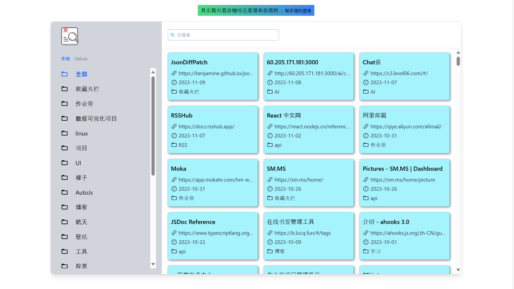
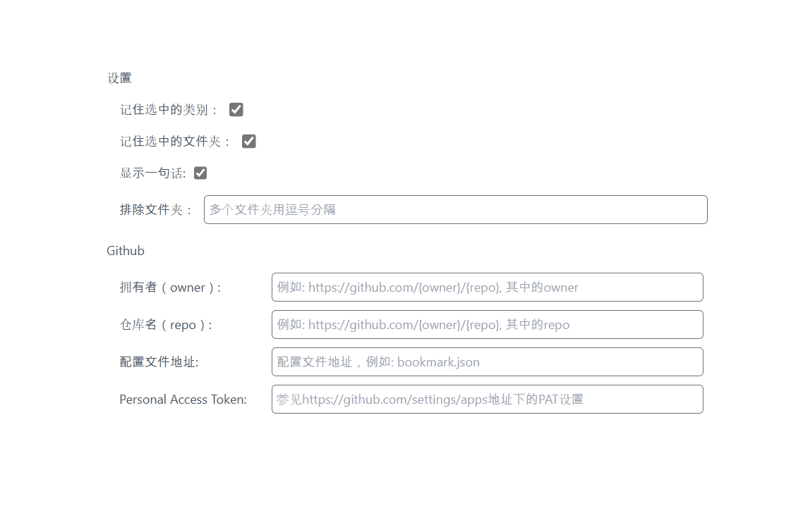

[中文文档](./README_zh.md)

<div align="center">

<h1> A better browser extension bookmarking tool </h1>


</div>

## 效果图

<div align="center">

</div>

## 配置项

<div align="center">

</div>

## 说明

### 设置项说明

- 记住选中的类别: 当你选择了`本地` 或者 `github` 时，下次打开 tab 或者刷新 tab 时会记住你选中的那个类别
- 记住选中的文件夹: 当你选择了文件夹时，下次打开 tab 或者刷新 tab 时会记住你选中的那个类别
- 显示一句话: 是否显示[一言](https://hitokoto.cn/)
- 排除文件夹: 允许排除一些文件夹不显示，文件夹之间用逗号隔开，例如："电影，开发"

#### Github 配置说明

> 以下配置内容没有配置完整时，`github` 类别不可使用，一个实际可用的配置如下：
>
> ```json
> {
>   "github": {
>     "owner": "chenweiyi",
>     "repo": "bookmarks",
>     "path": "bookmark.json",
>     "token": "xxxxxx" // 个人 access token
>   }
> }
> ```
>
> 一个可以参考的 github 仓库地址： https://github.com/chenweiyi/bookmarks

- 拥有者: 仓库拥有者
- 仓库名: 仓库名称
- 配置文件地址: 读取文件的地址，比如需要读取文件地址是`bookmark.json`, 配置文件需使用`.json`文件, 文件格式参见[说明](github-json_zh.md)
- Personal Access Token: `access token`, 参见[Github Settings](https://github.com/settings/tokens?type=beta)

---

## Thanks To

[Jonghakseo](https://nookpi.tistory.com/)

## License

[MIT](/LICENSE)
