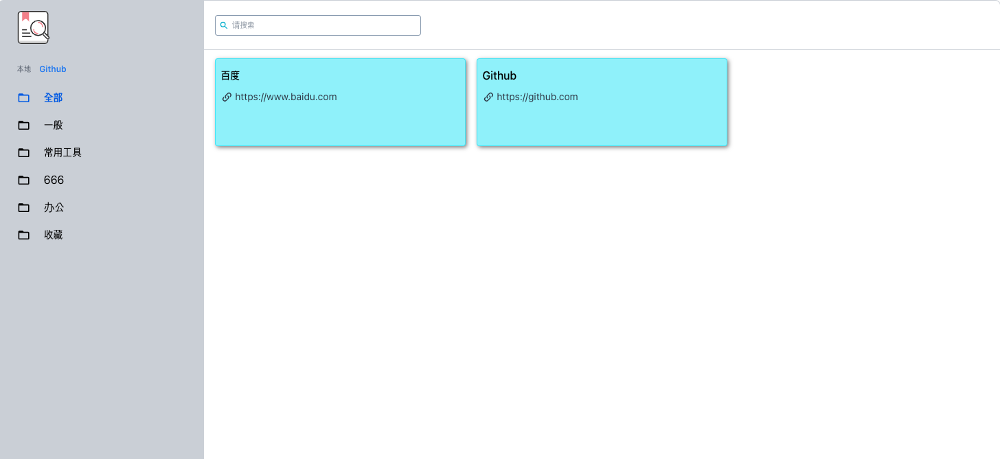

## GitHub 文件格式说明

在你的 github 仓库中，准备一个`.json`的文件，比如：`bookmark.json`, 然后在里面添加类似以下内容：

```json
[
  {
    "title": "Google",
    "url": "https://www.google.com",
    "tags": ["google", "search"]
  },
  {
    "title": "GitHub",
    "url": "https://github.com",
    "tags": ["github", "code"]
  }
]
```

上面的 json 文件只是一个例子，你可以配置你想添加的任何网站。

## json 文件字段说明

正如你在上面例子中看到的，json 文件是一个对象数组，每一个对象有如下字段：

| 字段  | 说明       |
| :---- | :--------- |
| title | 网站的标题 |
| url   | 网站的链接 |
| tags  | 网站的标签 |

## 展示的效果如下：


